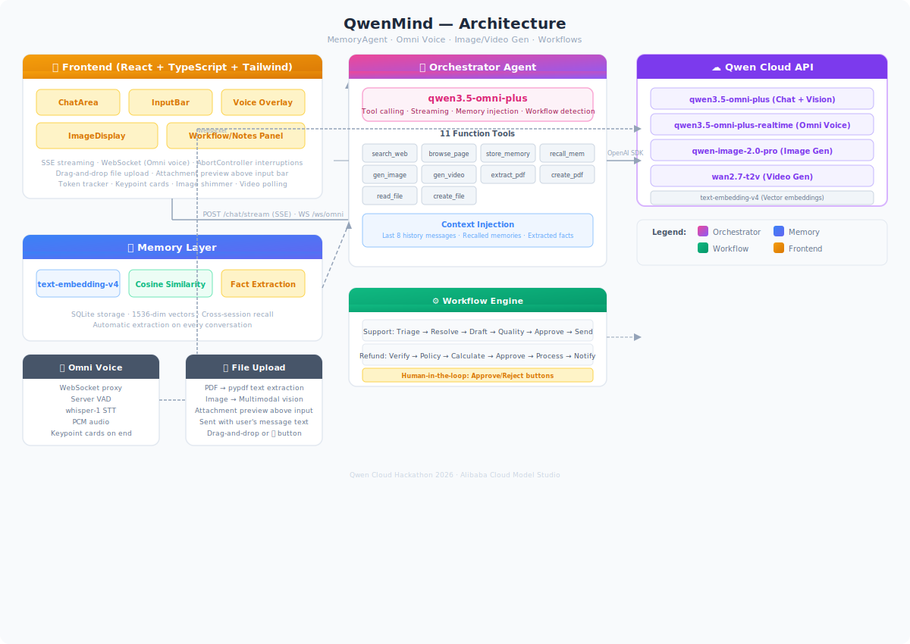

# Architecture Overview



## Three-Layer Agent System

### 1. MemoryAgent — Persistent Memory Layer
- **Qwen Embeddings** (`text-embedding-v4`) convert facts into vectors
- **SQLite** stores conversations, profiles, and extracted facts
- **Cosine similarity** retrieval for cross-session recall
- **Auto-extraction**: Every message pair triggers `summarize_and_extract()`, which uses Qwen to identify and store important facts

### 2. Agent Society — Multi-Agent Routing Layer
- **OrchestratorAgent**: Entry point. Routes user messages, manages tools (search, memory, files, PDF, browser)
- **TriageAgent**: Classifies inquiries (bug/feature/billing/general + urgency + sentiment)
- **ResolverAgent**: Suggests solutions using knowledge
- **WriterAgent**: Drafts professional responses
- **QualityAgent**: Reviews drafts (PASS/REVISE)
- Orchestrator auto-invokes these agents when a workflow is triggered

### 3. Autopilot — Workflow Engine Layer
- **WorkflowEngine**: State machine for structured business processes
- **Workflows defined**:
  - `support`: triage → resolve → draft_response → quality_check → human_approval → send
  - `refund`: verify_purchase → check_policy → calculate_refund → human_approval → process_refund → notify_customer
- **Human-in-loop**: Workflow pauses at `human_approval` step, emits SSE event, waits for frontend button click
- **SSE streaming**: Each step emits `workflow_step` events with progress, status, and results

## Data Flow

```
User Message
    │
    ▼
┌─────────────────────────────────────────────────────┐
│  OrchestratorAgent                                  │
│  • Recalls cross-session memories                   │
│  • Calls Qwen LLM with tools (search, memory, PDF)  │
│  • Streams tokens + reasoning + tool calls via SSE   │
│  • Detects workflow keywords in user message         │
└─────────┬───────────────────────────────────────────┘
          │
          ├── No workflow ──► Response streamed to UI
          │
          └── Workflow detected ──►
              │
              ▼
    ┌─────────────────┐
    │ WorkflowEngine  │
    │ (state machine) │
    └────────┬────────┘
             │
    ┌────────▼────────┐
    │  TriageAgent    │  ← classifies inquiry
    └────────┬────────┘
             │
    ┌────────▼────────┐
    │  ResolverAgent  │  ← finds solution
    └────────┬────────┘
             │
    ┌────────▼────────┐
    │  WriterAgent    │  ← drafts response
    └────────┬────────┘
             │
    ┌────────▼────────┐
    │  QualityAgent   │  ← reviews (PASS/REVISE)
    └────────┬────────┘
             │
    ┌────────▼──────────┐
    │  Human Approval   │  ← SSE event + UI buttons
    │  (pauses until    │
    │   approve/reject) │
    └────────┬──────────┘
             │
      ┌──────┴──────┐
      ▼             ▼
   Approve       Reject
      │             │
      ▼             ▼
  Complete ←── Workflow ends
```

## Frontend Architecture

```
React + TypeScript + Tailwind CSS + Vite
    │
    ├── Sidebar: Agent society status, session info
    ├── ChatArea: Messages, streaming tokens, thinking panel
    ├── InputBar: Text input + mic button
    ├── NotesPanel: Live keypoints from speech
    ├── VoiceOverlay: Recording UI with waveform
    └── Workflow UI: Step progress bar + approve/reject buttons
```

## Tech Stack
- **Backend**: FastAPI + Uvicorn + OpenAI SDK (Qwen endpoint)
- **Frontend**: React 19 + TypeScript + Tailwind CSS + Vite
- **LLM**: Qwen Plus / Qwen Turbo (Alibaba Cloud Model Studio)
- **Voice**: Web Speech API (browser-native ASR)
- **Memory**: Qwen Embeddings + SQLite + cosine similarity
- **Tools**: Playwright (web search/browse), pypdf (PDF), fpdf2 (PDF generation)
